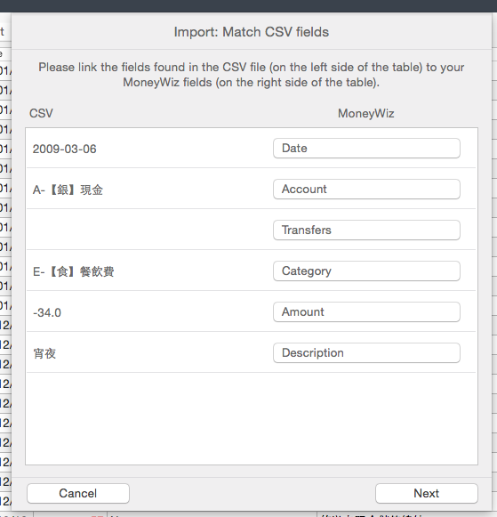

# macmoney-to-moneywiz

MacMoney to MoneyWiz 2 Converter

Since MacMoney is mostly used in Taiwan, this doc will be in Chinese only.

## 限制

* 在 MacMoney 裡面設定為「隱藏」的帳戶，匯入之後還是會顯示，建議自行開一個名為「沒在用」的 Group 來隱藏他們。
* 無法匯入 MacMoney 裡面的「星號」標記（MoneyWiz 匯入程式不支援）。在 MoneyWiz 裡面對應的功能是 Pending Transaction。
* 無法匯入帳務紀錄裡面的「備註」（MoneyWiz 匯入程式不支援）
* 無法匯入負債（我沒有使用；信用卡我用「資產」紀錄）
* 無法匯入分期付款（我沒有使用）

## 程式下載 & 安裝方法

* Download ZIP
* Bundle Install

TODO: non-developer-friendly doc

## 使用方法

本轉換程式並非從 MacMoney 的 CSV 匯出檔來匯入，而是直接讀取他的資料庫（PList）。

### 1. 找出你的帳本的位置

如果有打開 Dropbox 記帳的話，可以在「偏好設定」>「Dropbox」裡面找到檔案位置。

如果沒有打開 Dropbox 記帳的話，請這樣做：

1. 打開 Finder
2. 按下 <kbd>Cmd+G</kbd>，輸入 `~/Library/Application Support/MacMoney` 按下 Enter 鍵。

打開資料夾之後會有幾個檔案，請對照 MacMoney 的視窗標題決定你要轉換哪一個帳本，例如「個人帳本」則請使用「個人帳本.plist」。

### 2. 執行轉換程式

例如你的帳本在 `~/Dropbox/MacMoney/個人帳本.plist`，想要匯出 CSV 到 `~/Desktop/macmoney.csv` ，就執行：

```shell-session
ruby ~/Dropbox/MacMoney/個人帳本.plist ~/Desktop/macmoney.csv
```

會花一些時間。

轉換完成之後，終端機會出現訊息要你先在 MoneyWiz 開帳戶：

```
Please create the following accounts:

- 【銀】現金
  * Open Balance: 300.0
  *
- 【戶】郵局存款
  * Open Balance: 1000.0
  *
- 【戶】華南銀行帳戶
  * Open Balance: 0.0
  *
- 【卡】悠遊卡
  * Open Balance: 100.0
  *
- 【卡】iCash
  * Open Balance: 200.0
  * Hidden
- 【卡】玉山銀行信用卡
  * Open Balance: 0.0
  *
```

請把這些帳戶全部在 MoneyWiz 開好再接著匯入。

請注意 **Open Balance 要一致**。

### 3. 實際匯入到 MoneyWiz

打開 MoneyWiz，確定所有帳戶都開好了以後，按一下 File -> Import -> Import from a file

選取剛剛匯出的 ~/Desktop/macmoney.csv。

接著他會問你匯入欄位對應，請依照以下排序匯入：



順序是：

* Date
* Account
* Transfers
* Category
* Amount
* Description

接著幾個畫面是問你 Category 對照，請注意 MoneyWiz 只支援 1 對 1 匯入，若要合併，可以在匯入完成之後從「偏好設定」裡面整理。

## 重新匯入的方法

重新匯入的話，必須在每一個帳戶裡面刪除所有紀錄才行。MoneyWiz 不提供一次清空資料庫的功能，必須手動一個一個刪除。

方法是先切換到 table view，接著切換 Filter 為 All，按 Cmd + A 全選，按右鍵選擇 Delete。過程中 MoneyWiz 會沒有反應，是正常現象。

## LICENSE

MIT License. See LICENSE file.
